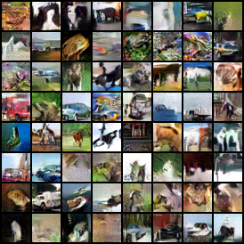

# Joint Energy-basd Modeling

This is an **unofficial** PyTorch implementation of ICLR2020-paper: 

[Your Classifier is Secretly an Energy Based Model and You Should Treat it Like One (Grathwohl et al, 2020)](https://arxiv.org/abs/1912.03263)

**Import Note**

I am not one of authors of this paper. This is only a private practice for the educational and academic purposes and it's highly recommended that you can refer to the authors' official source codes in this [repo](https://github.com/wgrathwohl/JEM).

---------------------------------------------------------------------------
## Dependencies

* PyTorch
* torchvision
* numpy
* tqdm
* opencv-python
* imageio
* matplotlib


---------------------------------------------------------------------------
## Preliminary about Energy-based Model (EBM)

To better understand the proposed method in JEM, here are some things and facts that the readers need to know in advance.

1. EBM usually presents an underlying distribution as the form of Gibbs distribution with the energy function, such as: 

    $P_{\theta}(x)=\dfrac{e^{-E_{\theta}(x)}}{Z}$, where $Z=\int_{}^{} e^{-E_{\theta}(x)}dx$

2. Since the natural log function $\ln(\cdot)$ is monotonic, given the collected dataset $D$, $\arg\max_\theta P_{\theta}(D) = \arg\max_\theta \ln{P_{\theta}(D)} = \arg\max_\theta -E_{\theta}(D) - \ln{Z_{\theta}}$  

3. Most of time, the term $Z$ is intractable and hard to estimate due to the complexity of high dimensional data. To address this difficulty, many Energy-based approaches will use sampling method like SGLD (see [here](https://github.com/ninechi143/PyTorch-LangevinDynamics) for the demo) to estimate the gradient of normalization term $Z$ w.r.t model parameters $\theta$.

4. Even though we can use the trick above for EBM, the training is still unstable and hard to converge due to the high variance from the sampling. Furthermore, the most important thing is, we still can not access the true answer about $Z$ even if the EBM is optimized.

You can refer to this [ref.](https://arxiv.org/abs/2101.03288) for more details.

---------------------------------------------------------------------------
## Joint Energy-based Modeling (JEM)
To better understand the proposed JEM, readers are recommended to first have a look at this [Blog Post](https://jmtomczak.github.io/blog/11/11_energy_based_models.html) which introduces that how a discriminative model (e.g., a neural network with softmax activation in final layer) can be regarded as an Energy-based Model.

Following the derivation in the ref. above, readers can realize that, by manipulating the logits fed into the softmax activation, you can get the "minus energy" term in EBMs.

To get a step further, this "manipulation" just reveals that how an EBM is hidden in the discriminative model and why the softmax function can get the posterior probability $P(y|x)$.

With this connection between discriminative models and EBMs, the authors further propose the Joint Energy-based Modeling which simultaneously optimize the posterior probability $P_{\theta}(y|x)$ and the marginal probability $P_{\theta}(x)$ by using the training tricks for generative modeling (e.g., use SGLD or other MCMCs to make sampling). 

There are some advantages of training the model jointly with generative and discriminative perspective:

1. The classification performance will keep the same level of normal training.

2. Since we train the model in the EBM manner, we can use the negative log-probability (that is, the "minus Energy function") to sythesize data.

3. There is possibility that we can leverage the optimized marginal probability $P_{\theta}(x)$ to address the out-of-distribution task and defend against the adversarial attack.

The remaining details can be refferd to in the paper.

---------------------------------------------------------------------------
## Training and Testing

The script `main.py` is the common entrance for the experiments.

You can simply run the normal training without JEM method, as the baseline, with this command:

```markdown
python main.py --mode baseline_train --gpu 0
```

On the other hand, you can also run the training for Energy OOD detection, such as:

```markdown
python main.py --mode energy_train --gpu 0
```

The default training setting has already been tuned by myself, so the convergence of training process should be fine.

You still can type `python main.py --help` or check `main.py` to adjust corresponging arguments.

```
optional arguments:
  --help          
  --mode MODE             MODE is either baseline_train or energy_train
  --gpu 0       
  --lr 0.0001          
  --batch_size 128   
  --optimizer adam
  --reinit_freq 0.05      Reinitialization frequency when running SGLD
  --sgld_step 20          Training will be more stable if you use longer step.
  --sgld_lr 1             Used in SGLD process
  --sgld_std 0.01         Used in SGLD process
```

Note 1: You can use Tensorboard to track the training process.
Note 2: For evergy 100 steps (default), it will synthesize data in the log directory for visualization. Besides, it will also run a long-term SGLD sampling and make it to GIF file every 500 steps.


---------------------------------------------------------------------------
## Results

Here, we use CIFAR10 dataset in the experiments, and the model architecure we use is [Wide-ResNet](https://arxiv.org/abs/1605.07146).

Note that we only implement the training part and data-generating part in this repository. For the full implementation, readers can refer to the [official source codes](https://github.com/wgrathwohl/JEM).

The following figures are the visualization results of synthesized data in the training process.

#### Synthesized Data in training process

| training step 0 (initial)| 
| ---------- |
| |

| step 100| 
| ---------- |
| |

| step 200| 
| ---------- |
| |

| step 300| 
| ---------- |
| |

| step 400| 
| ---------- |
| |

| step 1000| 
| ---------- |
| |

| step 5000| 
| ---------- |
| |

| step 10000| 
| ---------- |
| |

| step 15000| 
| ---------- |
| |

| SGLD process (sampling from noise)| 
| ---------- |
| |

| Cifar10 Testing Acc.| 
| ---------- |
| |

As shown above, we can see that the JEM gradually captures the underlying distribution $P_{\theta}(x)$ such that we can sample from it, without sacrificing the performance of classification task.

